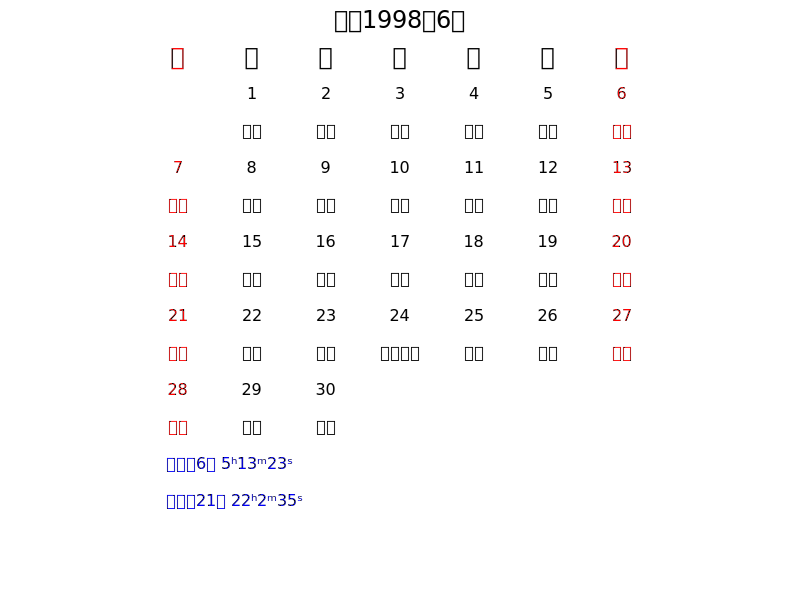

# go-calendar

[](https://travis-ci.org/mooncaker816/go-calendar) [](https://godoc.org/mooncaker816/go-calendar)

## 1. Install

### 1.1 VSOP87

This library is based on Astronomical Algorithms by Jean Meeus, which is already implemented by library [soniakeys/meeus](https://github.com/soniakeys/meeus).  
Additionally, "VSOP87" data files are required for calculating the planet position.
Those files are present in folder `VSOP87` of this repository, ***you just need download them to any directory and set ENV variable with name `VSOP87` for the directory***.

### 1.2 go-calendar package

Below command is suffcient to install this library, it will get all the packages according to the dependencies.

`go get github.com/mooncaker816/go-calendar/...`

## 2. 一些程序选用的定历规则

- 朔气同日，朔在前
- 纪年干支以春节为界，纪月干支以朔日为界（闰月同上月）
- 四柱：年柱以立春为界，月柱以节为界，日柱以零点为界，时柱以北京时间为准，未考虑地方时

## 3. 农历转阳历`LunarToSolar`

1. 正月-十二月依次对应月份值1-12，若为闰月，置 leap 标记为 true
2. 若查询的是武则天改历期间的农历正月，由于有一月的并存，请以11作为正月的值输入，其他不变
3. 若查询的是秦历后九月，周历闰十三月当作闰九月和闰十二月处理，对应的月份值分别为9，12

## 4. 阳历转农历`SolarToLunar`

1. 若输入的阳历日期在1582年10月4日之前（包含），则以儒略历日期计算农历，反之以格里历计算
2. 函数返回农历年，月，日，以及闰月标志

## 5. 日历`DayCalendar`

```go
	day, err := DayCalendar(2018, 6, 6, true, nil)
	if err != nil {
		fmt.Printf("DayCalendar failed:%v\n", err)
		return
	}
	fmt.Println(day)
```

```bash
公元2018年6月6日
星期三 双子座
JD 2458276
农历【狗】四月（大）廿三
戊戌年 丁巳月 己巳日
四柱：戊戌 戊午 己巳 甲子
```

## 6. 月历`MonthCalendar`

```go
	month, err := MonthCalendar(1998, 6, true, nil)
	if err != nil {
		fmt.Printf("MonthCalendar failed:%v\n", err)
		return
	}
	fmt.Println(month)
```

```bash
📅                    6月
     日    一    二    三    四    五    六
☀️         ㏠    ㏡    ㏢    ㏣    ㏤    ㏥
🌛        初七  初八  初九  初十  十一  十二
☀️   ㏦    ㏧    ㏨    ㏩    ㏪    ㏫    ㏬
🌛  十三  十四  十五  十六  十七  十八  十九
☀️   ㏭    ㏮    ㏯    ㏰    ㏱    ㏲    ㏳
🌛  二十  廿一  廿二  廿三  廿四  廿五  廿六
☀️   ㏴    ㏵    ㏶    ㏷    ㏸    ㏹    ㏺
🌛  廿七  廿八  廿九  五月® 初二  初三  初四
☀️   ㏻    ㏼    ㏽
🌛  初五  初六  初七

芒种：6日 5ʰ13ᵐ23ˢ
夏至：21日 22ʰ2ᵐ35ˢ
```



## 7. 年历`YearCalendar`

```go
	year, err := YearCalendar(2017, true)
	if err != nil {
		fmt.Printf("YearCalendar failed:%v\n", err)
		return
	}
	fmt.Println(year)
```

```bash
🗓️                 2017年（平）
📅                    1月
     日    一    二    三    四    五    六
☀️   ㏠    ㏡    ㏢    ㏣    ㏤    ㏥    ㏦
🌛  初四  初五  初六  初七  初八  初九  初十
☀️   ㏧    ㏨    ㏩    ㏪    ㏫    ㏬    ㏭
🌛  十一  十二  十三  十四  十五  十六  十七
☀️   ㏮    ㏯    ㏰    ㏱    ㏲    ㏳    ㏴
🌛  十八  十九  二十  廿一  廿二  廿三  廿四
☀️   ㏵    ㏶    ㏷    ㏸    ㏹    ㏺    ㏻
🌛  廿五  廿六  廿七  廿八  廿九  三十  正月
☀️   ㏼    ㏽    ㏾
🌛  初二  初三  初四

小寒：5日 11ʰ55ᵐ44ˢ
大寒：20日 5ʰ23ᵐ36ˢ
📅                    2月
     日    一    二    三    四    五    六
☀️                     ㏠    ㏡    ㏢    ㏣
🌛                    初五  初六  初七  初八
☀️   ㏤    ㏥    ㏦    ㏧    ㏨    ㏩    ㏪
🌛  初九  初十  十一  十二  十三  十四  十五
☀️   ㏫    ㏬    ㏭    ㏮    ㏯    ㏰    ㏱
🌛  十六  十七  十八  十九  二十  廿一  廿二
☀️   ㏲    ㏳    ㏴    ㏵    ㏶    ㏷    ㏸
🌛  廿三  廿四  廿五  廿六  廿七  廿八  廿九
☀️   ㏹    ㏺    ㏻
🌛  二月  初二  初三

立春：3日 23ʰ34ᵐ3ˢ
雨水：18日 19ʰ31ᵐ19ˢ
📅                    3月
     日    一    二    三    四    五    六
☀️                     ㏠    ㏡    ㏢    ㏣
🌛                    初四  初五  初六  初七
☀️   ㏤    ㏥    ㏦    ㏧    ㏨    ㏩    ㏪
🌛  初八  初九  初十  十一  十二  十三  十四
☀️   ㏫    ㏬    ㏭    ㏮    ㏯    ㏰    ㏱
🌛  十五  十六  十七  十八  十九  二十  廿一
☀️   ㏲    ㏳    ㏴    ㏵    ㏶    ㏷    ㏸
🌛  廿二  廿三  廿四  廿五  廿六  廿七  廿八
☀️   ㏹    ㏺    ㏻    ㏼    ㏽    ㏾
🌛  廿九  三十  三月  初二  初三  初四

惊蛰：5日 17ʰ32ᵐ43ˢ
春分：20日 18ʰ28ᵐ38ˢ
📅                    4月
     日    一    二    三    四    五    六
☀️                                       ㏠
🌛                                      初五
☀️   ㏡    ㏢    ㏣    ㏤    ㏥    ㏦    ㏧
🌛  初六  初七  初八  初九  初十  十一  十二
☀️   ㏨    ㏩    ㏪    ㏫    ㏬    ㏭    ㏮
🌛  十三  十四  十五  十六  十七  十八  十九
☀️   ㏯    ㏰    ㏱    ㏲    ㏳    ㏴    ㏵
🌛  二十  廿一  廿二  廿三  廿四  廿五  廿六
☀️   ㏶    ㏷    ㏸    ㏹    ㏺    ㏻    ㏼
🌛  廿七  廿八  廿九  四月  初二  初三  初四
☀️   ㏽
🌛  初五

清明：4日 22ʰ17ᵐ19ˢ
谷雨：20日 5ʰ27ᵐ0ˢ
📅                    5月
     日    一    二    三    四    五    六
☀️         ㏠    ㏡    ㏢    ㏣    ㏤    ㏥
🌛        初六  初七  初八  初九  初十  十一
☀️   ㏦    ㏧    ㏨    ㏩    ㏪    ㏫    ㏬
🌛  十二  十三  十四  十五  十六  十七  十八
☀️   ㏭    ㏮    ㏯    ㏰    ㏱    ㏲    ㏳
🌛  十九  二十  廿一  廿二  廿三  廿四  廿五
☀️   ㏴    ㏵    ㏶    ㏷    ㏸    ㏹    ㏺
🌛  廿六  廿七  廿八  廿九  三十  五月  初二
☀️   ㏻    ㏼    ㏽    ㏾
🌛  初三  初四  初五  初六

立夏：5日 15ʰ31ᵐ2ˢ
小满：21日 4ʰ30ᵐ55ˢ
📅                    6月
     日    一    二    三    四    五    六
☀️                           ㏠    ㏡    ㏢
🌛                          初七  初八  初九
☀️   ㏣    ㏤    ㏥    ㏦    ㏧    ㏨    ㏩
🌛  初十  十一  十二  十三  十四  十五  十六
☀️   ㏪    ㏫    ㏬    ㏭    ㏮    ㏯    ㏰
🌛  十七  十八  十九  二十  廿一  廿二  廿三
☀️   ㏱    ㏲    ㏳    ㏴    ㏵    ㏶    ㏷
🌛  廿四  廿五  廿六  廿七  廿八  廿九  六月
☀️   ㏸    ㏹    ㏺    ㏻    ㏼    ㏽
🌛  初二  初三  初四  初五  初六  初七

芒种：5日 19ʰ36ᵐ36ˢ
夏至：21日 12ʰ24ᵐ8ˢ
📅                    7月
     日    一    二    三    四    五    六
☀️                                       ㏠
🌛                                      初八
☀️   ㏡    ㏢    ㏣    ㏤    ㏥    ㏦    ㏧
🌛  初九  初十  十一  十二  十三  十四  十五
☀️   ㏨    ㏩    ㏪    ㏫    ㏬    ㏭    ㏮
🌛  十六  十七  十八  十九  二十  廿一  廿二
☀️   ㏯    ㏰    ㏱    ㏲    ㏳    ㏴    ㏵
🌛  廿三  廿四  廿五  廿六  廿七  廿八  廿九
☀️   ㏶    ㏷    ㏸    ㏹    ㏺    ㏻    ㏼
🌛  六月® 初二  初三  初四  初五  初六  初七
☀️   ㏽    ㏾
🌛  初八  初九

小暑：7日 5ʰ50ᵐ41ˢ
大暑：22日 23ʰ15ᵐ21ˢ
📅                    8月
     日    一    二    三    四    五    六
☀️               ㏠    ㏡    ㏢    ㏣    ㏤
🌛              初十  十一  十二  十三  十四
☀️   ㏥    ㏦    ㏧    ㏨    ㏩    ㏪    ㏫
🌛  十五  十六  十七  十八  十九  二十  廿一
☀️   ㏬    ㏭    ㏮    ㏯    ㏰    ㏱    ㏲
🌛  廿二  廿三  廿四  廿五  廿六  廿七  廿八
☀️   ㏳    ㏴    ㏵    ㏶    ㏷    ㏸    ㏹
🌛  廿九  三十  七月  初二  初三  初四  初五
☀️   ㏺    ㏻    ㏼    ㏽    ㏾
🌛  初六  初七  初八  初九  初十

立秋：7日 15ʰ39ᵐ59ˢ
处暑：23日 6ʰ20ᵐ12ˢ
📅                    9月
     日    一    二    三    四    五    六
☀️                                 ㏠    ㏡
🌛                                十一  十二
☀️   ㏢    ㏣    ㏤    ㏥    ㏦    ㏧    ㏨
🌛  十三  十四  十五  十六  十七  十八  十九
☀️   ㏩    ㏪    ㏫    ㏬    ㏭    ㏮    ㏯
🌛  二十  廿一  廿二  廿三  廿四  廿五  廿六
☀️   ㏰    ㏱    ㏲    ㏳    ㏴    ㏵    ㏶
🌛  廿七  廿八  廿九  八月  初二  初三  初四
☀️   ㏷    ㏸    ㏹    ㏺    ㏻    ㏼    ㏽
🌛  初五  初六  初七  初八  初九  初十  十一

白露：7日 18ʰ38ᵐ36ˢ
秋分：23日 4ʰ1ᵐ47ˢ
📅                    10月
     日    一    二    三    四    五    六
☀️   ㏠    ㏡    ㏢    ㏣    ㏤    ㏥    ㏦
🌛  十二  十三  十四  十五  十六  十七  十八
☀️   ㏧    ㏨    ㏩    ㏪    ㏫    ㏬    ㏭
🌛  十九  二十  廿一  廿二  廿三  廿四  廿五
☀️   ㏮    ㏯    ㏰    ㏱    ㏲    ㏳    ㏴
🌛  廿六  廿七  廿八  廿九  三十  九月  初二
☀️   ㏵    ㏶    ㏷    ㏸    ㏹    ㏺    ㏻
🌛  初三  初四  初五  初六  初七  初八  初九
☀️   ㏼    ㏽    ㏾
🌛  初十  十一  十二

寒露：8日 10ʰ22ᵐ7ˢ
霜降：23日 13ʰ26ᵐ40ˢ
📅                    11月
     日    一    二    三    四    五    六
☀️                     ㏠    ㏡    ㏢    ㏣
🌛                    十三  十四  十五  十六
☀️   ㏤    ㏥    ㏦    ㏧    ㏨    ㏩    ㏪
🌛  十七  十八  十九  二十  廿一  廿二  廿三
☀️   ㏫    ㏬    ㏭    ㏮    ㏯    ㏰    ㏱
🌛  廿四  廿五  廿六  廿七  廿八  廿九  十月
☀️   ㏲    ㏳    ㏴    ㏵    ㏶    ㏷    ㏸
🌛  初二  初三  初四  初五  初六  初七  初八
☀️   ㏹    ㏺    ㏻    ㏼    ㏽
🌛  初九  初十  十一  十二  十三

立冬：7日 13ʰ37ᵐ48ˢ
小雪：22日 11ʰ4ᵐ38ˢ
📅                    12月
     日    一    二    三    四    五    六
☀️                                 ㏠    ㏡
🌛                                十四  十五
☀️   ㏢    ㏣    ㏤    ㏥    ㏦    ㏧    ㏨
🌛  十六  十七  十八  十九  二十  廿一  廿二
☀️   ㏩    ㏪    ㏫    ㏬    ㏭    ㏮    ㏯
🌛  廿三  廿四  廿五  廿六  廿七  廿八  廿九
☀️   ㏰    ㏱    ㏲    ㏳    ㏴    ㏵    ㏶
🌛  三十  冬月  初二  初三  初四  初五  初六
☀️   ㏷    ㏸    ㏹    ㏺    ㏻    ㏼    ㏽
🌛  初七  初八  初九  初十  十一  十二  十三
☀️   ㏾
🌛  十四

大雪：7日 6ʰ32ᵐ39ˢ
冬至：22日 27ᵐ56ˢ
```

## 8. 精度

推荐1654到未来200年间，精度较高，以下是与寿星天文历的相对误差，可作参考

| 年份 | 平均相差 | ΔT取值相差 | 忽略ΔT后相差 |
|------|:--------:|:----------:|:------------:|
| 1600 |  ≈1m20s  | 20s        |≈1m           |
| 1700 |  ≈5s     | 1.8s       |≈3.2s         |
| 1800 |  ≈5s     | 2.1s       |≈2.9s         |
| 1900 |  ≈2s     | 1.2s       |≈0.8s         |
| 2000 |  ≈20-30s | 25s        |≈5s           |
| 2100 |  ≈2m30s  | 0s         |≈2m30s        |
| 2200 |  ≈2m30s  | 0s         |≈2m30s        |
| 2300 |  ≈8m     | 0s         |≈8m           |
| 2400 |  ≈18m    | 0s         |≈18m          |
| 2500 |  ≈30m    | 0s         |≈30m          |
| 2600 |  ≈45m    | 0s         |≈45m          |
| 2700 |  ≈1h5m   | 0s         |≈1h5m         |